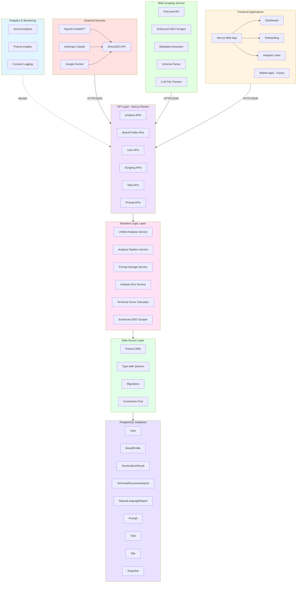
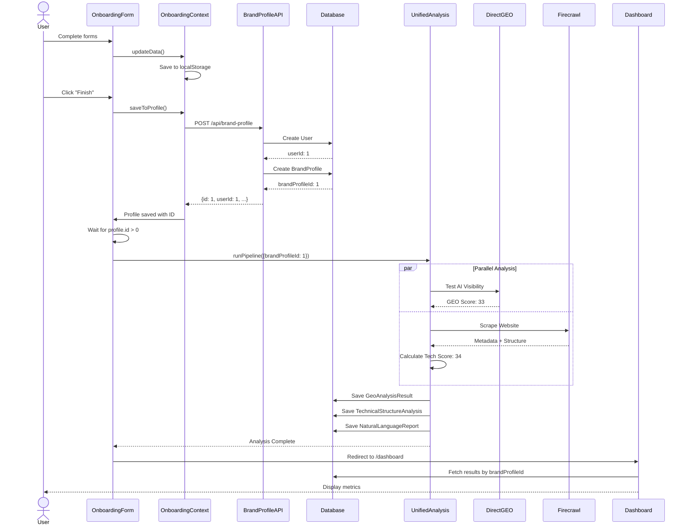
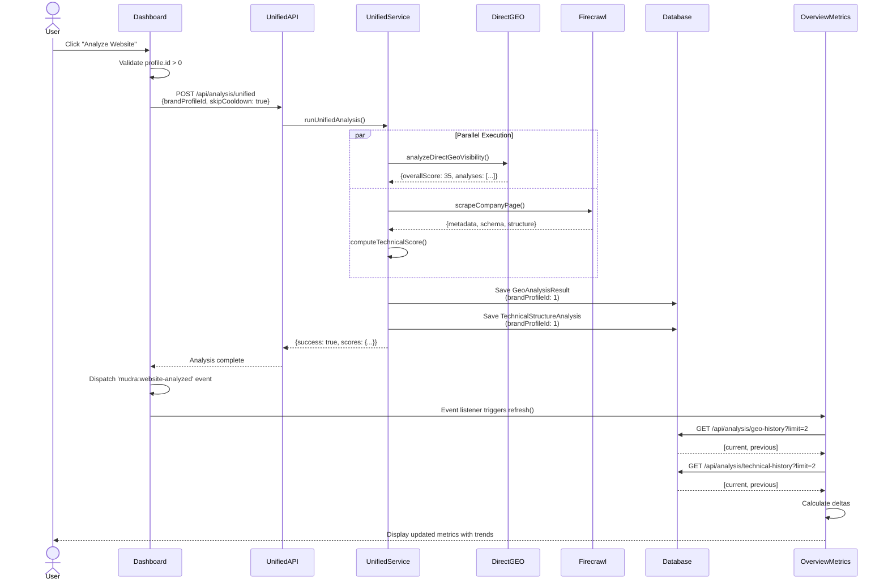
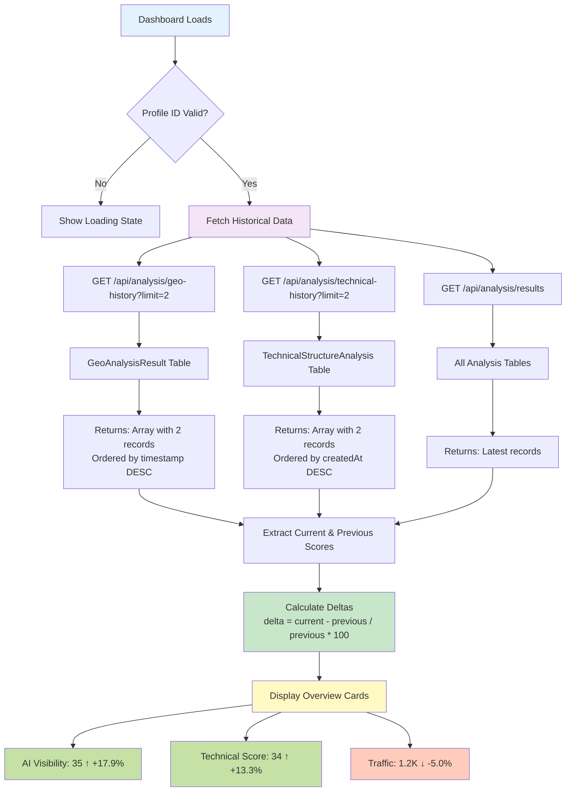
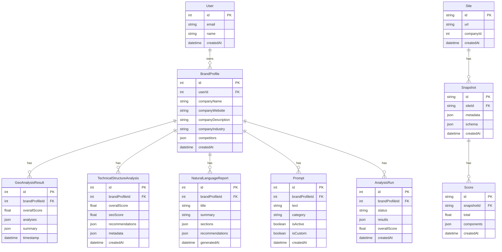
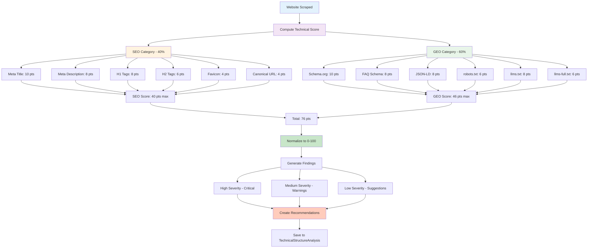
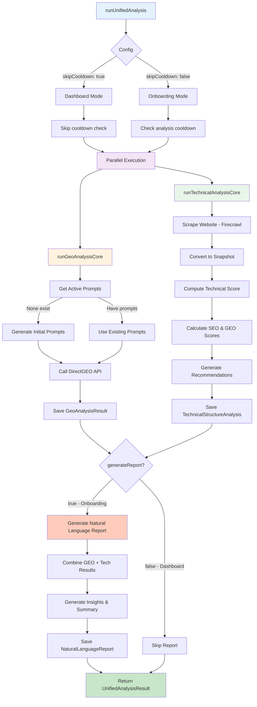
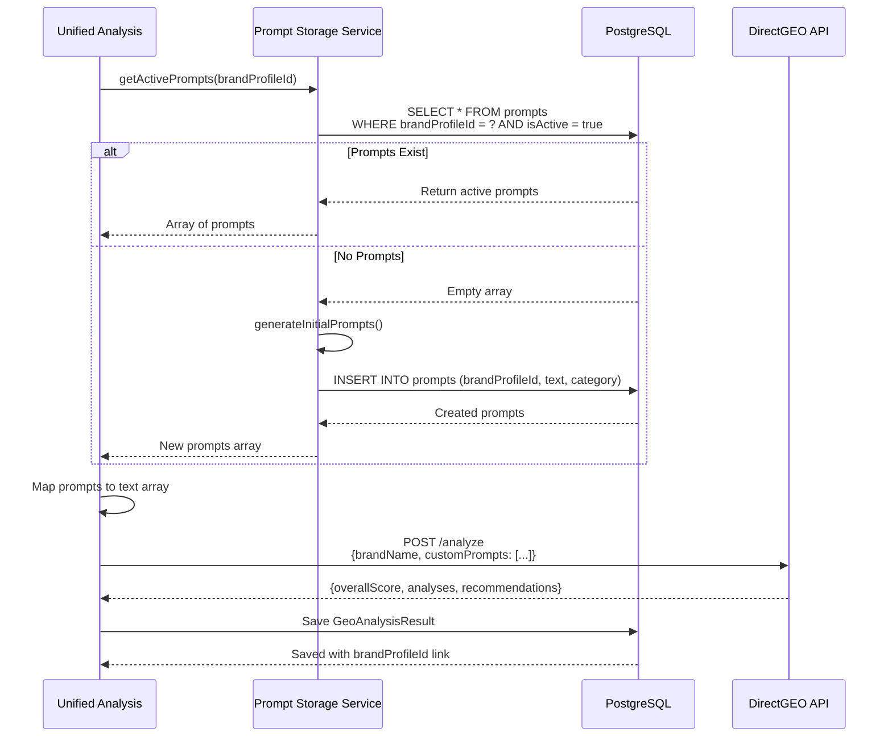
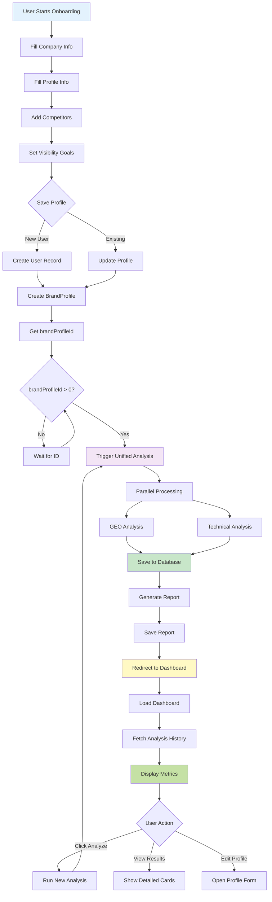

# Mudra MVP - Mermaid Architecture Diagrams

## System Architecture Overview



## Detailed Component Architecture

```mermaid
graph LR
    subgraph Client["Client Layer"]
        C1[Browser]
        C2[Next.js App]
    end

    subgraph APIRoutes["API Routes"]
        A1[/api/analysis/unified]
        A2[/api/analysis/pipeline]
        A3[/api/analysis/geo-history]
        A4[/api/analysis/technical-history]
        A5[/api/analysis/results]
        A6[/api/brand-profile]
        A7[/api/run-scraper]
        A8[/api/prompts]
    end

    subgraph CoreServices["Core Services"]
        S1[Unified Analysis]
        S2[Analysis Pipeline]
        S3[Prompt Storage]
        S4[Technical Scorer]
    end

    subgraph ExternalAPIs["External APIs"]
        X1[DirectGEO API]
        X2[Firecrawl API]
    end

    subgraph DataLayer["Data Layer"]
        D1[(PostgreSQL)]
        D2[Prisma Client]
    end

    C1 --> C2
    C2 --> A1 & A2 & A3 & A4 & A5 & A6 & A7 & A8
    A1 & A2 --> S1
    S1 --> S2 & S3 & S4
    S1 --> X1 & X2
    S2 & S3 & S4 --> D2
    D2 --> D1

    style Client fill:#e3f2fd
    style APIRoutes fill:#f3e5f5
    style CoreServices fill:#e8f5e9
    style ExternalAPIs fill:#fff3e0
    style DataLayer fill:#fce4ec
```

## Onboarding Flow



## Dashboard "Analyze Website" Flow



## Historical Metrics Flow



## Database Schema Relationships



## Technical Scoring Components



## Unified Analysis Service Architecture



## Prompt Management Flow



## Component Interaction Map

```mermaid
graph LR
    subgraph Frontend_Components
        FC1[Dashboard Page]
        FC2[Overview Metrics]
        FC3[Analysis Results Cards]
        FC4[Brand Profile Form]
        FC5[Onboarding Forms]
    end
    
    subgraph Hooks
        H1[use-brand-profile]
        H2[use-analysis-pipeline]
        H3[use-analysis-results]
        H4[use-direct-geo-analysis]
    end
    
    subgraph Context
        CTX1[BrandProfileContext]
        CTX2[OnboardingContext]
    end
    
    subgraph API_Endpoints
        API1[/api/analysis/unified]
        API2[/api/analysis/geo-history]
        API3[/api/analysis/technical-history]
        API4[/api/brand-profile]
    end
    
    FC1 --> H1 & H3
    FC2 --> H3
    FC3 --> H3
    FC4 --> H1
    FC5 --> H2
    
    H1 --> CTX1
    H2 --> API1
    H3 --> API2 & API3
    H5 --> CTX2
    
    CTX1 --> API4
    
    style Frontend_Components fill:#e3f2fd
    style Hooks fill:#f3e5f5
    style Context fill:#fff3e0
    style API_Endpoints fill:#e8f5e9
```

## Data Flow: Onboarding to Dashboard


