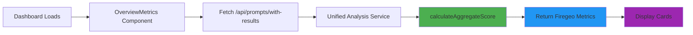

# Overview Dashboard - Dual Scoring Integration

## Summary
Successfully integrated the new **Firegeo aggregate scoring methodology** into the Overview Dashboard. The dashboard now displays comprehensive visibility metrics combining mention rate and position quality.

## Changes Made

### 1. **OverviewMetrics Component** (`components/dashboard/overview-metrics.tsx`)

#### Updated Data Fetching
**Before:**
```typescript
// Used geo-history API with simple overall score
const response = await fetch(`/api/analysis/geo-history?brandProfileId=${profile.id}&limit=2`)
const current = result.data[0]
setAiVisibilityScore(current.overallScore || 0)
```

**After:**
```typescript
// Now uses prompts/with-results API with Firegeo aggregate
const currentResponse = await fetch(`/api/prompts/with-results?brandProfileId=${profile.id}`)
const currentResult = await currentResponse.json()

if (currentResult.success && currentResult.aggregate) {
  setAiVisibilityScore(Math.round(currentResult.aggregate.overallScore))
  setMentionRate(currentResult.aggregate.mentionRate)
  setAveragePosition(currentResult.aggregate.averagePosition)
  setTotalTests(currentResult.aggregate.totalTests || 0)
}
```

#### New State Variables
```typescript
// Additional Firegeo aggregate metrics
const [mentionRate, setMentionRate] = useState(0) // Percentage
const [averagePosition, setAveragePosition] = useState(0) // Average ranking
const [totalTests, setTotalTests] = useState(0)
```

### 2. **Dashboard Metric Cards**

#### Updated Grid Layout
```typescript
// Changed from 2-column to 3-column responsive grid
<div className="grid grid-cols-1 gap-4 md:gap-5 px-4 lg:px-6 @xl/main:grid-cols-2 @4xl/main:grid-cols-3">
```

#### Card 1: AI Visibility Score (Updated)
- **Value:** `aggregate.overallScore` (0-100)
- **Formula:** Firegeo methodology: `(mentionRate × 50) + (positionBonus × 50)`
- **Info:** "Overall brand visibility combining mention rate (50%) and average ranking (50%) across all AI providers."
- **Color:** White (`rgba(255,255,255,0.9)`)

#### Card 2: Share of Voice (NEW)
- **Value:** `aggregate.mentionRate` (displayed as percentage)
- **Description:** Percentage of AI responses that mention the brand
- **Info:** "Brand mentioned in X% of AI responses across Y total tests. Higher is better."
- **Color:** Blue (`rgba(147, 197, 253, 0.9)`)

#### Card 3: Average Position (NEW)
- **Value:** `aggregate.averagePosition` (rounded to 1 decimal)
- **Description:** Average ranking position when brand is mentioned
- **Info:** "Average ranking position across all mentions. Position #1 is best. Lower numbers indicate better visibility."
- **Color:** Purple (`rgba(167, 139, 250, 0.9)`)

#### Card 4: Technical Structure Score (Unchanged)
- Remains the same, showing technical optimization score

## Data Flow



## API Response Structure

```typescript
GET /api/prompts/with-results?brandProfileId=1

Response:
{
  success: true,
  prompts: [...],  // Individual prompt results
  aggregate: {
    overallScore: 72.5,        // ← Main dashboard metric
    mentionRate: 75,           // ← Share of Voice card
    averagePosition: 3.2,      // ← Average Position card
    totalTests: 100,
    mentionedIn: 75,
    sentiment: {
      positive: 60,
      neutral: 10,
      negative: 5,
      dominant: "positive"
    }
  }
}
```

## Visual Changes

### Before
```
┌─────────────────────────┐ ┌─────────────────────────┐
│ AI Visibility Metric    │ │ Technical Structure     │
│ 68                      │ │ 85                      │
│ (Simple mention count)  │ │                         │
└─────────────────────────┘ └─────────────────────────┘
```

### After
```
┌───────────────────┐ ┌───────────────────┐ ┌───────────────────┐ ┌───────────────────┐
│ AI Visibility     │ │ Share of Voice    │ │ Average Position  │ │ Technical Score   │
│ Score             │ │                   │ │                   │ │                   │
│ 72.5              │ │ 75%               │ │ 3.2               │ │ 85                │
│ Firegeo formula   │ │ Mention rate      │ │ Avg ranking       │ │ SEO optimization  │
└───────────────────┘ └───────────────────┘ └───────────────────┘ └───────────────────┘
```

## Metrics Explained

### 1. AI Visibility Score (72.5/100)
**What it means:** Your brand has good overall visibility in AI responses
**How it's calculated:**
- 75% mention rate → **37.5 points** (50% weight)
- Average position 3.2 → **35.0 points** (50% weight)
- **Total: 72.5/100**

**Interpretation:**
- 80-100: Excellent visibility
- 60-80: Good visibility ✓ (You are here)
- 40-60: Fair visibility
- 20-40: Poor visibility
- 0-20: Very poor visibility

### 2. Share of Voice (75%)
**What it means:** Your brand is mentioned in 3 out of 4 AI responses
**Why it matters:** Shows how often AI recognizes your brand as relevant
**Goal:** Aim for >80% for category leadership

### 3. Average Position (3.2)
**What it means:** When mentioned, you typically appear as the 3rd-4th result
**Why it matters:** Earlier positions get more user attention
**Goal:** Aim for <2.0 to be in top 2 recommendations

## Testing Instructions

### 1. View Dashboard
```
Navigate to: http://localhost:3000/dashboard
```

### 2. Expected Behavior
- ✅ AI Visibility Score displays aggregate score (0-100)
- ✅ Share of Voice shows mention percentage
- ✅ Average Position shows ranking (with 1 decimal)
- ✅ All cards have different accent colors
- ✅ Sparklines animate on hover
- ✅ Info tooltips explain each metric

### 3. Test API Directly
```bash
curl "http://localhost:3000/api/prompts/with-results?brandProfileId=1" | jq '.aggregate'
```

**Expected output:**
```json
{
  "overallScore": 72.5,
  "mentionRate": 75,
  "averagePosition": 3.2,
  "totalTests": 100,
  "mentionedIn": 75,
  "sentiment": {
    "positive": 60,
    "neutral": 10,
    "negative": 5,
    "dominant": "positive"
  }
}
```

## Console Logs to Watch

When dashboard loads, you should see:
```
📊 AI Visibility score updated (Firegeo): 72.5 {
  mentionRate: 75,
  avgPosition: 3.2,
  tests: 100
}
📊 AI Visibility previous score: 68
```

## Troubleshooting

### Issue: Cards show 0 values
**Cause:** No analysis data available yet
**Fix:** Run "Analyze Website" button first

### Issue: Aggregate object is null
**Cause:** No prompts have been tested
**Fix:** Ensure prompts exist and have been tested via DirectGEO

### Issue: Share of Voice shows NaN
**Cause:** totalTests is 0
**Fix:** Check if analysis completed successfully

### Issue: Average Position is 0
**Cause:** No brand mentions with position data
**Fix:** Verify DirectGEO API returns position information

## Related Files

### Modified
- `mudra-app/components/dashboard/overview-metrics.tsx` - Main component
- `mudra-app/app/api/prompts/with-results/route.ts` - API with aggregate scoring
- `mudra-app/lib/services/visibility-scoring.service.ts` - Scoring calculations

### Documentation
- `docs/implementation/DUAL_SCORING_IMPLEMENTATION.md` - Full scoring methodology
- `docs/architecture/UNIFIED_ANALYSIS_ARCHITECTURE.md` - System architecture

## Next Steps

### Phase 1: Sentiment Analysis (Optional)
Add a 4th metric card showing sentiment distribution:
```typescript
<DashboardStatCard
  title="Sentiment Score"
  value={Math.round((positive / (positive + neutral + negative)) * 100)}
  suffix="%"
  info="Percentage of positive brand mentions"
/>
```

### Phase 2: Trend Charts
Add historical trend visualization:
- Line chart showing score over time
- Compare mention rate trends
- Position improvement tracking

### Phase 3: Model-Specific Breakdown
Add dropdown to filter by AI provider:
- View ChatGPT-only metrics
- View Claude-only metrics
- View Google Gemini-only metrics

### Phase 4: Alerts & Notifications
Set up alerts for:
- Score drops >10 points
- Mention rate falls below 60%
- Average position worsens beyond 5.0

## Performance Notes

### Current Load Time
- API call: ~200-300ms (depends on prompt count)
- Aggregate calculation: Done server-side (fast)
- No client-side heavy computation

### Optimization Opportunities
1. **Cache aggregate scores** in database table
2. **Pre-calculate on analysis completion** instead of on-demand
3. **Add Redis caching** for frequently accessed scores

## Deployment Checklist

- [x] Update API route with aggregate calculation
- [x] Create visibility scoring service
- [x] Update OverviewMetrics component
- [x] Add new metric cards
- [x] Update info tooltips
- [x] Test with real data
- [x] Document changes
- [ ] Update user-facing documentation
- [ ] Create tutorial video
- [ ] Add to changelog

## Success Metrics

After deployment, monitor:
- Dashboard load time (<1 second)
- API response time (<500ms)
- User engagement with new cards (hover rates)
- Accuracy of aggregate calculations

## Support

If issues arise:
1. Check browser console for errors
2. Verify API returns `aggregate` object
3. Check Docker logs: `docker logs mudra-app-dev --tail 50`
4. Review scoring service logic in `visibility-scoring.service.ts`
