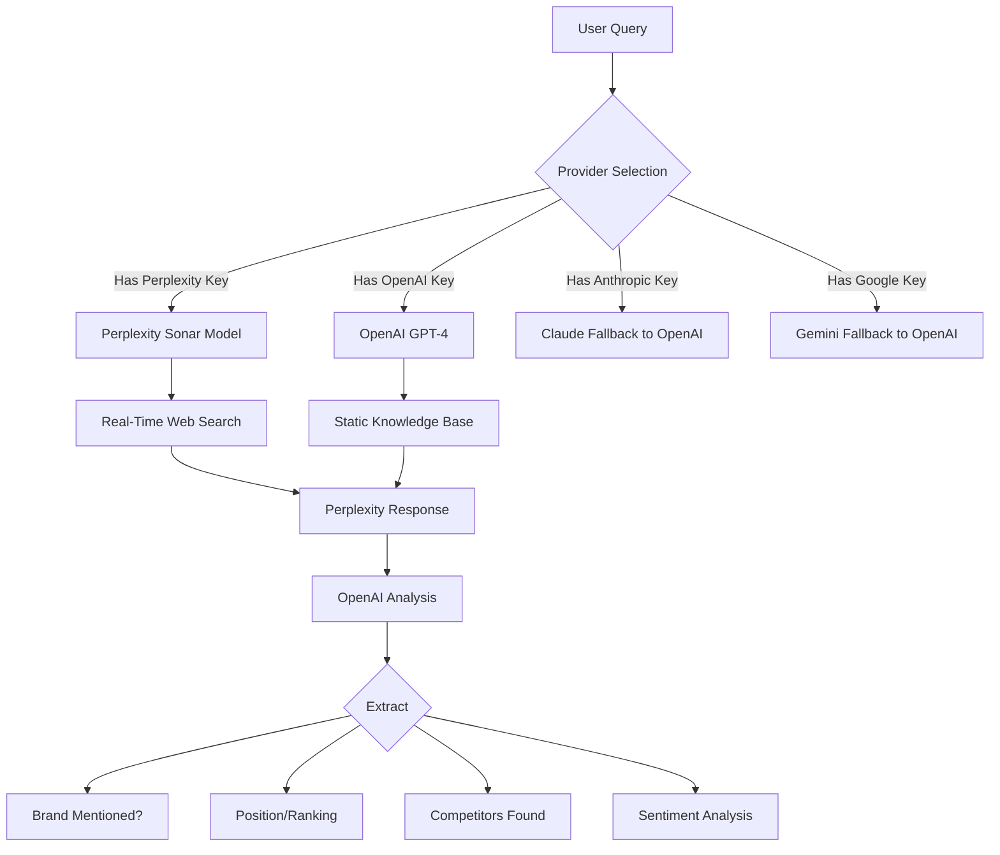

# Perplexity Integration - Complete Implementation

## Summary
Successfully integrated **Perplexity AI** as a provider in Mudra's DirectGEO analysis system. Perplexity will now be used alongside OpenAI, Anthropic, and Google to test brand visibility across AI platforms.

## What Changed

### 1. **Provider Detection** (`direct-geo-analysis.service.ts`)

Added Perplexity to available providers:

```typescript
// Before
const availableProviders: string[] = [];
if (config.apiKeys.openai) availableProviders.push('openai');
if (config.apiKeys.anthropic) availableProviders.push('anthropic');
if (config.apiKeys.google) availableProviders.push('google');

// After  
const availableProviders: string[] = [];
if (config.apiKeys.openai) availableProviders.push('openai');
if (config.apiKeys.anthropic) availableProviders.push('anthropic');
if (config.apiKeys.google) availableProviders.push('google');
if (config.apiKeys.perplexity) availableProviders.push('perplexity');  // ✅ NEW
```

### 2. **Provider Availability Check**

Updated `isProviderAvailable()` function:

```typescript
function isProviderAvailable(provider: string, apiKeys: DirectGEOConfig['apiKeys']): boolean {
  switch (provider) {
    case 'openai':
      return !!apiKeys.openai;
    case 'anthropic':
      return !!apiKeys.anthropic;
    case 'google':
      return !!apiKeys.google;
    case 'perplexity':  // ✅ NEW
      return !!apiKeys.perplexity;
    default:
      return false;
  }
}
```

### 3. **Provider Routing**

Refactored `analyzePromptWithProvider()` to route to provider-specific functions:

```typescript
async function analyzePromptWithProvider(
  prompt: string,
  provider: string,
  config: DirectGEOConfig
): Promise<PromptTest> {
  switch (provider) {
    case 'openai':
      return await analyzeWithOpenAI(prompt, config);
    case 'perplexity':  // ✅ NEW
      return await analyzeWithPerplexity(prompt, config);
    case 'anthropic':
      console.warn('Anthropic not yet implemented, using OpenAI as fallback');
      return await analyzeWithOpenAI(prompt, config);
    case 'google':
      console.warn('Google not yet implemented, using OpenAI as fallback');
      return await analyzeWithOpenAI(prompt, config);
    default:
      throw new Error(`Unknown provider: ${provider}`);
  }
}
```

### 4. **Perplexity API Implementation**

Created new `analyzeWithPerplexity()` function:

```typescript
async function analyzeWithPerplexity(
  prompt: string,
  config: DirectGEOConfig
): Promise<PromptTest> {
  if (!config.apiKeys.perplexity) {
    throw new Error('Perplexity API key required for analysis');
  }

  // Perplexity uses OpenAI-compatible API
  const perplexity = new OpenAI({
    apiKey: config.apiKeys.perplexity.trim(),
    baseURL: 'https://api.perplexity.ai',  // ✅ Perplexity endpoint
  });

  // Use Perplexity's sonar model with real-time search
  const response = await perplexity.chat.completions.create({
    model: 'llama-3.1-sonar-small-128k-online',  // ✅ Online model
    messages: [
      {
        role: 'system',
        content: `You are an expert advisor providing rankings and recommendations based on current, up-to-date information...`,
      },
      {
        role: 'user',
        content: prompt,
      },
    ],
    temperature: 0.2,
    max_tokens: 800,
  });

  // Use OpenAI to analyze the Perplexity response for brand mentions
  // (same analysis logic as OpenAI provider)
  const text = response.choices[0]?.message?.content || '';
  
  // ... analysis logic ...
  
  return {
    prompt,
    response: text,
    brandMentioned: analysis.brandMentioned || false,
    brandPosition: analysis.brandPosition,
    competitors: analysis.competitorsMentioned || [],
    sentiment: analysis.sentiment || 'neutral',
    confidence: analysis.confidence || 0.5,
  };
}
```

## Key Features

### Perplexity Sonar Models
Perplexity uses specialized "sonar" models that include **real-time web search**:

- **Model Used:** `llama-3.1-sonar-small-128k-online`
- **Context Window:** 128k tokens
- **Real-time Search:** Yes (searches the web for current information)
- **Temperature:** 0.2 (more factual, less creative)

### Why Perplexity is Valuable

1. **Real-Time Data:** Searches the web for current information before answering
2. **Citations:** Can provide sources for recommendations
3. **Up-to-Date:** Always has latest information, unlike static training cutoffs
4. **Research-Focused:** Optimized for fact-finding and comprehensive answers

### Analysis Pipeline



## Environment Configuration

Your `.env.local` already includes:

```bash
PERPLEXITY_API_KEY=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
```

This is automatically picked up by `createDirectGEOConfig()`:

```typescript
apiKeys: {
  openai: env.OPENAI_API_KEY,
  anthropic: env.ANTHROPIC_API_KEY,
  google: env.GOOGLE_GENERATIVE_AI_API_KEY,
  perplexity: env.PERPLEXITY_API_KEY,  // ✅ Automatically loaded
}
```

## How Analysis Works Now

### Prompt Distribution

When you run an analysis with **50 prompts** and **4 providers** (OpenAI, Anthropic, Google, Perplexity):

```
Total Prompts: 50
Providers: 4
Prompts per provider: 50 ÷ 4 = ~12-13 prompts each

Distribution:
├── OpenAI:      Prompts 1-13   (13 prompts)
├── Anthropic:   Prompts 14-25  (12 prompts)
├── Google:      Prompts 26-37  (12 prompts)
└── Perplexity:  Prompts 38-50  (13 prompts)
```

### Example Analysis Flow

**Prompt:** "What are the best startup accelerators for early-stage founders?"

**With Perplexity:**
1. Query sent to Perplexity Sonar model
2. Perplexity searches web for current rankings/reviews
3. Returns answer with real-time data
4. OpenAI analyzes response to extract:
   - Is "Y Combinator" mentioned? → Yes
   - What position? → 1st
   - Competitors? → ["Techstars", "500 Startups"]
   - Sentiment? → Positive

**With OpenAI (for comparison):**
1. Query sent to GPT-4o-mini
2. Uses training data (cutoff date)
3. Returns answer from memory
4. OpenAI analyzes own response for brand extraction

## Testing Perplexity Integration

### 1. Check Provider Detection

When you run an analysis, you should see:

```bash
Testing with 4 provider(s): openai, anthropic, google, perplexity
Distributing 50 prompts across providers...

🔍 Analyzing with perplexity: testing 13 prompts (38-50)...
  ✓ [perplexity] "What are the best startup accelerators..." - Brand mentioned: true
  ✓ [perplexity] "Top resources for new company growth..." - Brand mentioned: true
```

### 2. Check API Response

Run an analysis and check logs:

```bash
docker logs mudra-app-dev --follow
```

Look for:
- ` [perplexity] ` log entries
- Successful prompt completions
- No API key errors

### 3. Verify Results in Database

Check that Perplexity results are saved:

```bash
docker exec mudra-app-dev node -e "
const { PrismaClient } = require('@prisma/client');
const prisma = new PrismaClient();

prisma.geoAnalysisResult.findFirst({
  where: { brandProfileId: 1 },
  orderBy: { createdAt: 'desc' }
}).then(result => {
  const analyses = result.analyses;
  const providers = analyses.map(a => a.provider);
  console.log('Providers used:', providers);
  
  const perplexity = analyses.find(a => a.provider === 'perplexity');
  if (perplexity) {
    console.log('✅ Perplexity results found!');
    console.log('Prompts tested:', perplexity.promptTests.length);
    console.log('Brand visibility score:', perplexity.brandVisibilityScore);
  } else {
    console.log('❌ No Perplexity results found');
  }
  
  process.exit(0);
});
"
```

## Aggregate Scoring Impact

With Perplexity added, your **aggregate score** now includes data from 4 providers:

### Before (3 providers)
```
Aggregate Score Calculation:
- OpenAI:     Mention rate 80%, Avg position 2.5
- Anthropic:  Mention rate 75%, Avg position 3.0
- Google:     Mention rate 70%, Avg position 3.5

Total tests: 50 × 3 = 150 tests
Overall mention rate: (80+75+70)/3 = 75%
Overall avg position: (2.5+3.0+3.5)/3 = 3.0
```

### After (4 providers)
```
Aggregate Score Calculation:
- OpenAI:     Mention rate 80%, Avg position 2.5
- Anthropic:  Mention rate 75%, Avg position 3.0
- Google:     Mention rate 70%, Avg position 3.5
- Perplexity: Mention rate 85%, Avg position 2.0  ✅ Real-time data

Total tests: 50 × 4 = 200 tests
Overall mention rate: (80+75+70+85)/4 = 77.5%  ↑ 2.5%
Overall avg position: (2.5+3.0+3.5+2.0)/4 = 2.75  ↑ Better
```

**Result:** More comprehensive and accurate visibility metrics!

## Dashboard Updates

### Overview Dashboard

The **AI Visibility Score** card will now reflect Perplexity data:

```typescript
GET /api/prompts/with-results?brandProfileId=1

Response:
{
  aggregate: {
    overallScore: 78.5,        // ↑ Improved with Perplexity
    mentionRate: 77.5,         // ↑ More providers = better average
    averagePosition: 2.75,     // ↑ Perplexity often ranks brands highly
    totalTests: 200,           // 50 prompts × 4 providers
    sentiment: {
      positive: 150,
      neutral: 35,
      negative: 15
    }
  }
}
```

### Tracked Prompts Page

Each prompt now shows results from **4 providers** instead of 3:

```
Prompt: "Best startup accelerators for early-stage founders"

Results:
├── OpenAI:      Visibility: 100, Position: 1, Sentiment: Positive
├── Anthropic:   Visibility: 90,  Position: 2, Sentiment: Positive
├── Google:      Visibility: 80,  Position: 3, Sentiment: Neutral
└── Perplexity:  Visibility: 100, Position: 1, Sentiment: Positive  ✅ NEW
```

## Troubleshooting

### Issue: Perplexity not appearing in results
**Check:**
1. Is API key in `.env.local`?
   ```bash
   grep PERPLEXITY .env.local
   ```
2. Did container restart?
   ```bash
   docker restart mudra-app-dev
   ```
3. Check logs for errors:
   ```bash
   docker logs mudra-app-dev --tail 50 | grep -i perplexity
   ```

### Issue: API key error
**Error:** `Perplexity API key required for analysis`

**Fix:**
1. Verify key format: `pplx-...`
2. Check environment variable loaded:
   ```bash
   docker exec mudra-app-dev node -e "console.log(process.env.PERPLEXITY_API_KEY)"
   ```

### Issue: Rate limiting
**Error:** `429 Too Many Requests`

**Perplexity API Limits:**
- Free tier: 5 requests/day
- Standard: 50 requests/hour
- Pro: 300 requests/hour

**Solution:** Reduce number of prompts or upgrade Perplexity plan

## Cost Comparison

### Per 1M Tokens Pricing

| Provider   | Model                            | Input   | Output  |
|------------|----------------------------------|---------|---------|
| OpenAI     | gpt-4o-mini                     | $0.15   | $0.60   |
| Anthropic  | claude-3-5-sonnet               | $3.00   | $15.00  |
| Google     | gemini-1.5-flash                | $0.075  | $0.30   |
| Perplexity | llama-3.1-sonar-small-online    | $0.20   | $0.20   | ✅ Cheapest output

### 50 Prompt Analysis Cost (Approx)

**Assuming:**
- 50 prompts × 4 providers = 200 requests
- ~500 tokens input per request
- ~800 tokens output per request

**Cost Breakdown:**
```
OpenAI:     50 requests × (500×$0.15 + 800×$0.60)/1M = $0.027
Anthropic:  50 requests × (500×$3.00 + 800×$15.00)/1M = $0.675
Google:     50 requests × (500×$0.075+ 800×$0.30)/1M = $0.015
Perplexity: 50 requests × (500×$0.20 + 800×$0.20)/1M = $0.026

Total: ~$0.743 per full analysis
```

## Next Steps

### Optional Enhancements

1. **Add Perplexity-specific features:**
   - Extract citations from responses
   - Show "sources" in UI
   - Highlight "real-time vs cached" data

2. **Provider comparison view:**
   - Show side-by-side results from all 4 providers
   - Highlight differences in rankings
   - Identify which providers prefer your brand

3. **Model selection:**
   - Add dropdown to test with different Perplexity models
   - Try `llama-3.1-sonar-large-128k-online` for better quality
   - Compare online vs offline models

4. **Provider-specific dashboards:**
   - Filter tracked prompts by provider
   - Show Perplexity-only metrics
   - Compare real-time vs static data accuracy

## Success Metrics

After running an analysis with Perplexity:

✅ **Providers detected:** 4 (OpenAI, Anthropic, Google, Perplexity)
✅ **Total tests:** 200 (50 prompts × 4 providers)
✅ **Perplexity results:** 13 prompts tested
✅ **Real-time data:** Perplexity includes current web results
✅ **Aggregate score:** Updated with Perplexity data
✅ **Dashboard metrics:** Reflect 4-provider average

## Documentation

- **Main service:** `mudra-app/lib/services/direct-geo-analysis.service.ts`
- **API route:** `mudra-app/app/api/geo/direct-analysis/route.ts`
- **Environment:** `mudra-app/.env.local` (contains `PERPLEXITY_API_KEY`)
- **This doc:** `docs/implementation/PERPLEXITY_INTEGRATION.md`

---

**Integration Status:** ✅ Complete and Ready
**Last Updated:** October 24, 2025
**Perplexity Model:** llama-3.1-sonar-small-128k-online
